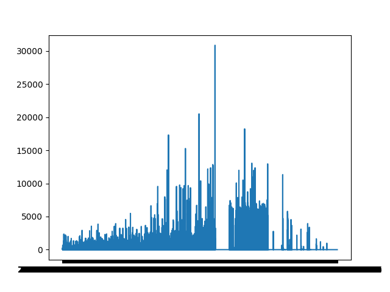
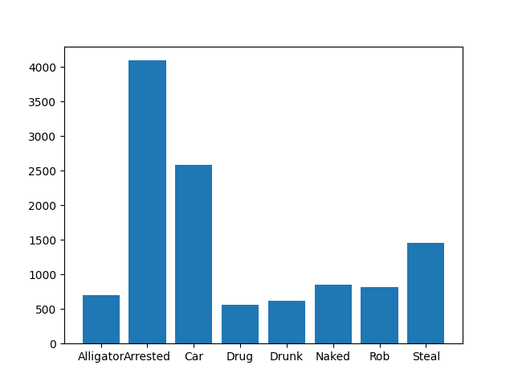
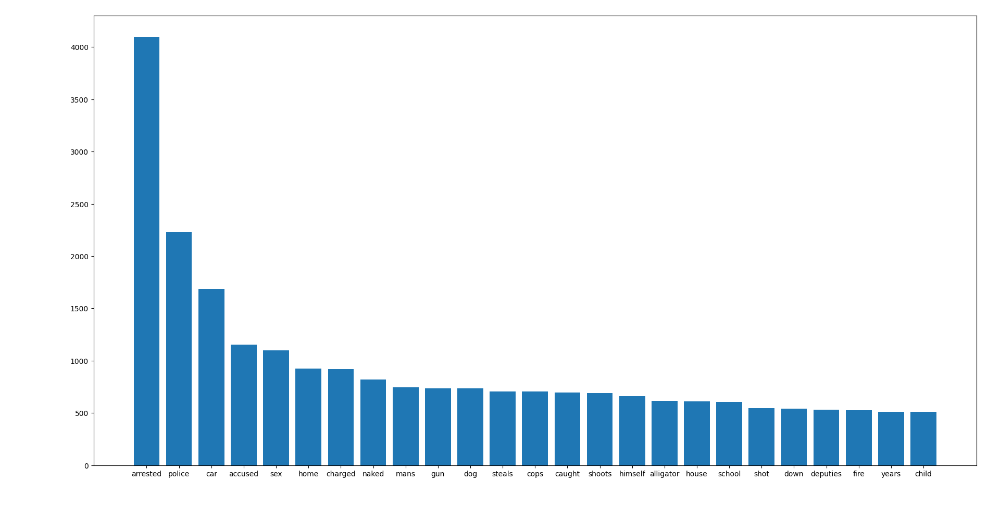

# Florida Man Does Data Analysis on Florida Man Headlines

And you can too

## The data

The Florida Man data set is a collection of over 40,000 Florida Man headlines collected from the r/FloridaMan subreddit. These headlines were collected from January 1st, 2014 to April 30th, 2022. In addition to the headlines, the data also inclues the post id, date and time posted, the score of the post, the user who posted it, and the url of the source article.

**This data set is not filtered directly in the file, only in the python code**

## Filtering

Due to the nature of the collection of the data, not all of the headlines are relevant. Some are ads and posts about the subreddit itself. The best way that I found to filter the data was to only allow headlines that include "florida" and "man", as well as manually adding some exceptions to exclude ads that inclue "florida" or "man". There are also many duplicate headlines, which are removed by dropping any duplicate titles or urls.

## Usage

Just run the `florida.py` file

Upon running, 3 graphs should pop up and look like this:

The `florida_man.csv` file is also included for your convenience

## Source

This dataset was obtained from [here](https://www.kaggle.com/datasets/bcruise/reddit-rfloridaman).
